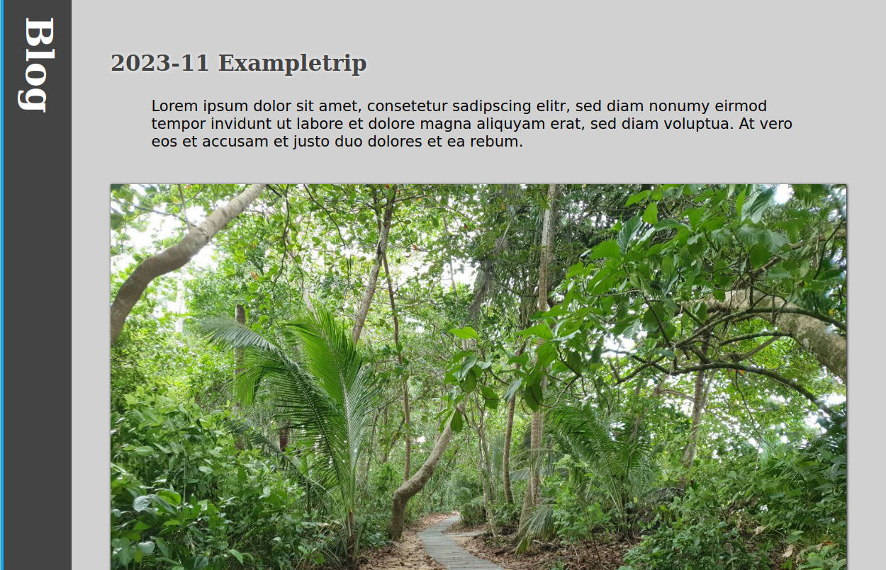

# TelegramBlog
Create posts on a self-hosted blog via messaging a Telegram bot



## Setup
- copy all files to webspace
- adjust file permissions and optionally restrict direct access to updatesite.php, see **.htaccess** as an example
- set title and description in **index.php**
- create a Telegram bot and set its accesstoken in **updatesite.php**

## Local Setup for development

You can set up your local development environment using the provided Docker stack. To get started, follow these steps:

1. Run the following command to launch the Docker stack in the background: 
    ```bash
    docker compose up -d
    ```

2. Once the stack is up and running, you can access the blog example at [localhost](http://localhost).
    > **_NOTE_**  
   If you prefer a more user-friendly domain for your local development, you can create a custom alias, for example, "telegram-bot.local," by adding the following line to your /etc/hosts file:  
    > 
    > `echo -e "127.0.0.1\ttelegram-bot.local" | sudo tee -a /etc/hosts`

## Usage
- post a photo with or wihtout caption or just text to your Telegram bot directly. Alternatively, add the bot to a group and post messages there (the Bot needs to be admin to read all messages).
- new messages will be fetched by default simply by accessing index.php. This behaviour might be disabled in index.php (see first variable) and e.g. triggered by a cronjob: ```php -f /path/to/updatesite.php [debug] ```

